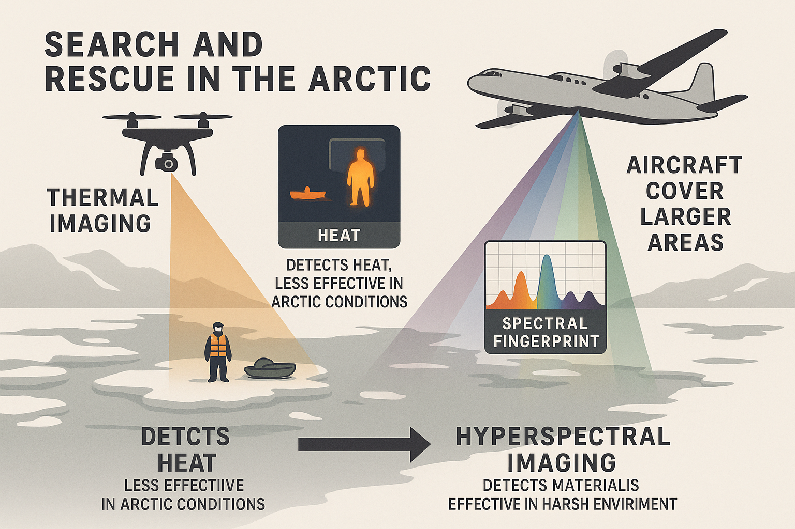

# Arctic SAR: Hyperspectral Imaging for Search & Rescue 

*Last updated: 2025-10-16*

## Project Summary

When a person or boat goes missing in the Arctic, local Search and Rescue (SAR) teams must cover large areas very quickly. Most searches today use **drones** and **thermal cameras** that detect **heat**. This technology works best when there’s a strong temperature difference between people and the ground. But during daylight, in fog, or on water, thermal sensors don't always work. Thermal sensors also have trouble when the surface is cold or when people wear insulated clothing.

**Hyperspectral imaging** is different. Instead of measuring heat, it captures **hundreds of narrow colors of light** that reflect from different materials, such as life jackets, boats, or human skin. Every object has a unique “spectral fingerprint.” By teaching the computer what these fingerprints look like, hyperspectral cameras can find people or debris even when they’re cold, covered, or in the water (Fig. 1).

Because the Yukon–Kuskokwim (Y–K) Delta is so big and hard to reach, **manned aircraft** are better for this system than small drones. Aircraft can carry heavier sensors, cover hundreds of miles, and stay in the air for hours. Drones are excellent for local follow-up, but airplanes are faster for wide-area searches after storms. Our proposal would combine Nalaquq’s experience in local SAR training with new **real-time hyperspectral imaging** developed by Jayson Boubin (SUNY-B) to help villages like Quinhagak, Eek, and Goodnews detect people and boats quickly and safely.

---

## Summary Table of Past Research

| No. | Citation | Platform | Sensor Type / Range | Main Application | SAR Relevance | URL |
| --- | -------- | -------- | -------------------- | ---------------- | -------------- | --- |
| 1 | Park et al. (2023) – *Adv. Space Res.* | Manned aircraft (Cessna 208) | Specim AisaEAGLE (400–1000 nm, 127 bands) | Small-object detection at sea | Direct maritime SAR use; detected mannequins and lifebuoys | [Link](https://www.sciencedirect.com/science/article/pii/S0273117723005148) |
| 2 | Krekeler et al. (2023) – *Environ. Earth Sci.* | Ground / lab-based | FieldSpec 4 (350–2500 nm) | Human materials library (skin, clothing, blood) | Foundation for human detection and spectral library design | [Link](https://doi.org/10.1007/s12665-023-10761-1) |
| 3 | Bhargava et al. (2024) – *Heliyon* | Airborne, UAV, Satellite | Multi-platform review (0.4–2.5 µm) | Agriculture, flood, medical, and disaster applications | Establishes core sensor principles, flood mapping methods useful to SAR | [Link](https://doi.org/10.1016/j.heliyon.2024.e33208) |
| 4 | Stevenson et al. (2005) – *SPIE* | Manned aircraft (CAP ARCHER) | VNIR pushbroom HSI + panchromatic | Real-time U.S. Civil Air Patrol system | Operational manned-aircraft HSI for SAR | [Link](https://www.spiedigitallibrary.org/conference-proceedings-of-spie/5787/0000/The-civil-air-patrol-ARCHER-hyperspectral-sensor-system/10.1117/12.604458.full) |
| 5 | Schaum (2015) – *Applied Optics* | Algorithmic (NRL) | ACE/RX algorithms | Spectral anomaly detection | Real-time algorithms for spectral cueing | [Link](https://opg.optica.org/viewmedia.cfm?r=1&seq=0&uri=ao-54-31-F286) |
| 6 | Yan et al. (2019) – *Optical Review* | Hyperspectral dataset | Deep learning (CNN) | Small-object detection | Adaptable to debris/person detection from HSI | [Link](https://link.springer.com/article/10.1007/s10043-019-00528-0) |
| 7 | Army University Press (2024) – *AI-HyperCal* | Tactical aircraft | AI-based calibration system | Crash/wreckage detection | Real-time calibration under field conditions | [Link](https://www.armyupress.army.mil/Journals/Military-Review/Online-Exclusive/2024-OLE/AI-HyperCal/) |
| 8 | USGS (2014) – *OFR 2014-1197* | Airborne/ground | ENVI-based workflow | Environmental anomaly mapping | Workflow transferable to SAR spectral anomaly detection | [Link](https://pubs.usgs.gov/of/2014/1197/pdf/of2014-1197.pdf) |
| 9 | Wired (2007) – *Super-Vision Camera Search* | CAP ARCHER aircraft | VNIR system | Steve Fossett search | Documented real-world HSI SAR use | [Link](https://www.wired.com/2007/09/fossettcamera) |

---

## Next Steps for Our Working Group

- Establish working group with releveant interested research teams (ADOT, UiT, SUNY-B, Scott Polar, Nalaquq)
- Determine funding priorities, in-kind contributions, etc.  
- Develop a **Arctic spectral library** including local materials (PFDs, aluminum skiffs, float coats, snowmachines).
- Select data collection sites and secure requisite permissions for flights. 
- Employ **manned aircraft** for regional coverage, with **drones** for follow-up verification.  
- Ensure all data collection follows **Nalaquq’s co-production principles** for community control and training.

---

